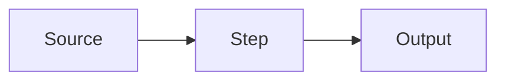
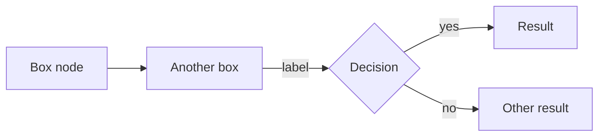
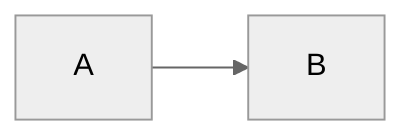

# Mermaid Diagrams — Guardian Edition

Mermaid renders text-based diagrams directly in GitHub Markdown. Guardian uses Mermaid in PR descriptions to show delivery flows, architecture changes, and request paths. This skill covers both the PR description format and standalone diagram creation for platform documentation.

## PR Description Diagrams (primary use case)

Guardian's `description-preamble.md` defines the canonical format. Follow these rules exactly:

**Format:**
```html
<details open>
<summary><b>Architecture & Delivery Diagram</b></summary>



</details>
```

**Rules:**
- Always `flowchart LR` (horizontal) — never TD or other orientations
- **Maximum 7 nodes** — split complex flows into multiple diagrams if needed
- Use `<details open>` — not collapsed `<details>` — diagrams with labelled edges inside collapsed details blocks fail to render when expanded on GHES (known GitHub bug)
- Use the exact summary label: `<b>Architecture & Delivery Diagram</b>`

**Include the diagram when the PR shows:**
- Infrastructure delivery flow (Terraform, CI/CD pipeline changes)
- Runtime architecture changes (new services, changed routing, integration wiring)
- Request or data flow through meaningful components
- Control flow between major system components
- Workflow call chain changes in GitHub Actions

**Omit the diagram entirely for:**
- Docs-only changes
- Dependency bumps
- Single-file trivial changes
- Prompt or YAML text edits with no structural flow change
- Any PR where there is no meaningful flow to show

## Guardian Platform Templates

For common Guardian and REA platform patterns, see `references/guardian-templates.md`.

Templates available:
- **Workflow call chain** — consumer repo → Guardian platform → reusable workflow
- **Prompt assembly pipeline** — the 5-layer prompt stack
- **Profile resolution** — how a profile is selected and overlays applied
- **Consumer topology** — how multiple consumer repos share the platform
- **Request/data flow** — generic PR delivery flow template

## Diagram Type Selection

| Type | Use for | Reference |
|------|---------|-----------|
| **Flowchart** | Delivery flows, CI/CD pipelines, decision paths, request routing | `references/guardian-templates.md` |
| **Sequence** | Step-by-step interactions between Guardian components, GitHub Actions job sequences | `references/sequence-diagrams.md` |
| **C4** | System context and container architecture for standalone platform docs | `references/c4-diagrams.md` |

For PR descriptions, always prefer **flowchart LR**. Sequence and C4 diagrams are for standalone documentation, not PR descriptions.

For rendering rules, safe diagram types, character escaping, and GHES compatibility details, read `references/github-rendering.md`.

## Core Syntax



**Node shapes:**
- `[text]` — rectangle (process step, component)
- `([text])` — stadium/pill (start/end)
- `{text}` — diamond (decision)
- `[[text]]` — subroutine
- `[(text)]` — cylinder (database/storage)

**Arrow types:**
- `-->` — solid arrow
- `-.->` — dashed arrow (optional/conditional path)
- `--text-->` or `-->|text|` — labelled arrow

## Theming

**Do not hardcode a theme in PR comment diagrams.** GitHub automatically syncs Mermaid's theme to the viewer's appearance setting (light mode → `default`, dark mode → `dark`). Specifying `%%{init: {"theme": "..."}}%%` disables that sync, locking the diagram to one theme regardless of the viewer's mode — causing poor contrast for roughly half of viewers.

Leave theming unset for all PR description diagrams. Custom `classDef` and `linkStyle` still work and are safe to use.

For standalone documentation (not PR comments), you may set a theme via frontmatter:



## Common Pitfalls

- **Special characters break nodes** — `( ) [ ] { } % # " & < >`, smart quotes, em-dashes, and non-ASCII characters all cause parse failures. Wrap any label containing these in double quotes; inside quoted labels use Mermaid entity codes (`#40;` for `(`, `#41;` for `)`, `#35;` for `#`). Node IDs must be `[A-Za-z0-9_]+` only — no hyphens in IDs.
- **Too many nodes** — more than 7 makes the diagram unreadable in a PR comment; cut ruthlessly
- **Missing labels on arrows** — label every non-obvious connection
- **Wrong orientation** — PR description diagrams are always LR; TD is only for standalone docs
- **Over-diagramming** — a wrong diagram misleads reviewers; omit rather than guess
- **Legacy aliases** — use `flowchart` (not `graph`), `stateDiagram-v2` (not `stateDiagram`); legacy forms may fail on newer GHES versions
- **Pasting from rich-text editors** — smart quotes and em-dashes from word processors silently break diagrams; always type Mermaid syntax directly

## Rendering on GHES

GitHub Enterprise bundles the Mermaid version that shipped with each GHES release — it cannot be upgraded independently. **Safe diagram types across all supported GHES versions:** `flowchart`, `sequenceDiagram`, `classDiagram`, `stateDiagram-v2`, `erDiagram`, `gantt`, `pie`, `gitGraph`.

Newer types (architecture, kanban, radar, packet) are only available on GHES instances running recent releases, and on GitHub.com (Mermaid 11.4.1 as of April 2025). Stick to the safe list for PR descriptions unless you have confirmed the GHES version supports the type.

To check Mermaid version on any GitHub instance, render: ` ```mermaid\ninfo\n``` `

Note: GitHub mobile does not render Mermaid — raw code is shown.
