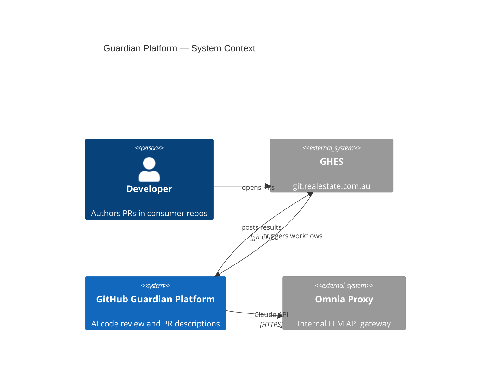
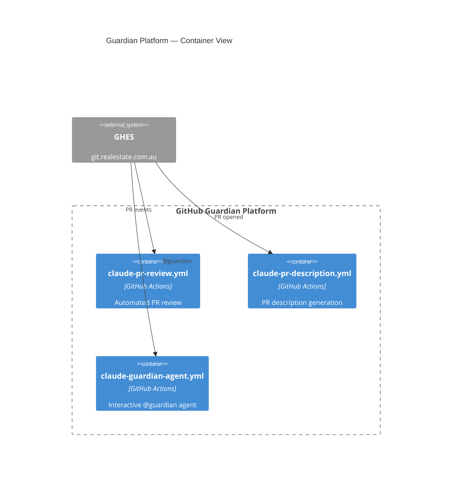

# C4 Diagrams — GitHub/GHES Edition

Use C4 in **standalone platform documentation** (README, architecture docs, wikis) where the Mermaid version is known. Do not use C4 in automated PR description diagrams.

---

## C4 Levels

| Level | Type | Use for |
|-------|------|---------|
| 1 | `C4Context` | Big picture: system + users + external dependencies |
| 2 | `C4Container` | Inside the system: services, databases, queues |
| 3 | `C4Component` | Inside one container: internal modules and their relationships |

Start with the level that answers the question. Context diagrams are for stakeholders; Container and Component diagrams are for engineers.

---

## C4Context

**Key elements:**
- `Person(id, "Name", "Description")` — human actor
- `Person_Ext(id, "Name", "Description")` — external human
- `System(id, "Name", "Description")` — your system
- `System_Ext(id, "Name", "Description")` — external system
- `Rel(from, to, "label")` or `Rel(from, to, "label", "technology")`
- `Rel_U` / `Rel_D` / `Rel_R` / `Rel_L` — directional variants that route the arrow arc, helping avoid label collision
- `UpdateLayoutConfig($c4ShapeInRow="N")` — controls how many nodes per row; use `"2"` for 4-node diagrams to avoid the single-row label-overlap problem
- `UpdateRelStyle(from, to, $offsetX="N", $offsetY="N")` — floats a label relative to the line midpoint (SVG pixels, works on GitHub.com Mermaid 11.4.1)

---

## C4Container

**Additional element types:**
- `ContainerDb(id, "Name", "Tech", "Description")` — database/storage
- `ContainerQueue(id, "Name", "Tech", "Description")` — message queue
- `Container_Ext(id, "Name", "Tech", "Description")` — external container

---

## GitHub-Safe Notes

- **C4 requires a recent GHES version** — always verify with `info` before deploying
- **No `%%{init}%%` theme override** — same as all Mermaid: let GitHub handle light/dark sync
- **`[CONTAINER]` / `[SYSTEM]` text in boundary headers** — `Container_Boundary` hardcodes the word `CONTAINER` into every header; use `Boundary(id, "Name", " ")` with a space as the third argument to suppress it (the space passes the renderer's empty-check but renders invisibly)
- **Label overlap is unfixed in Mermaid 11.4.1** — use `UpdateLayoutConfig($c4ShapeInRow="2")` to break flat layouts into two rows, and `UpdateRelStyle` with `$offsetX`/`$offsetY` to manually offset individual labels; there is no automatic collision avoidance
- **Multiple relationships from one node** — use `Rel_D` (downward) for all and spread labels with `UpdateRelStyle` offsets (e.g., `-40`, `0`, `+40`) rather than letting Mermaid auto-place them all at the same midpoint
- **`UpdateRelStyle` works on GitHub.com** but may be ignored on older GHES versions
- If a C4 diagram fails on GHES, switch to an equivalent `flowchart LR` — see `references/guardian-templates.md` for ready-made alternatives
