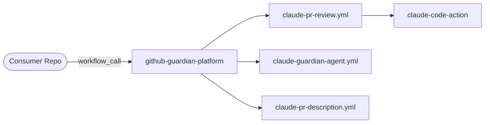
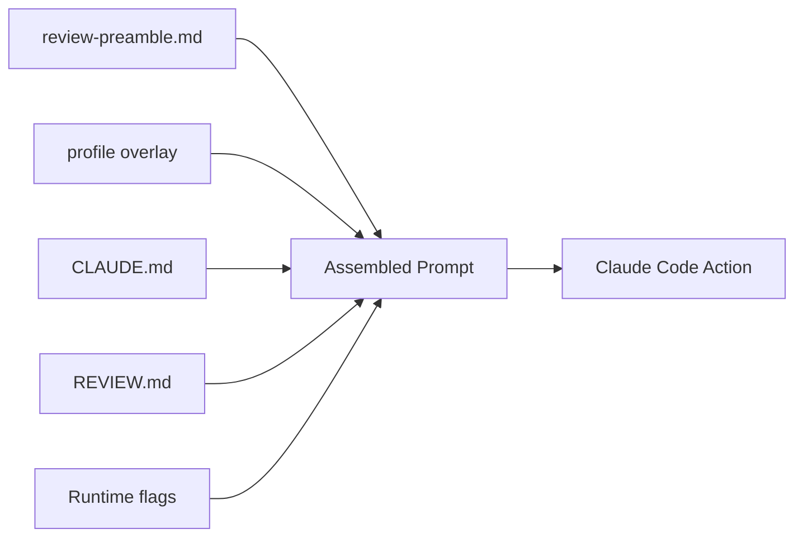
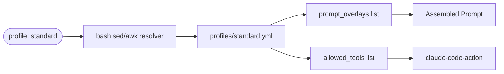
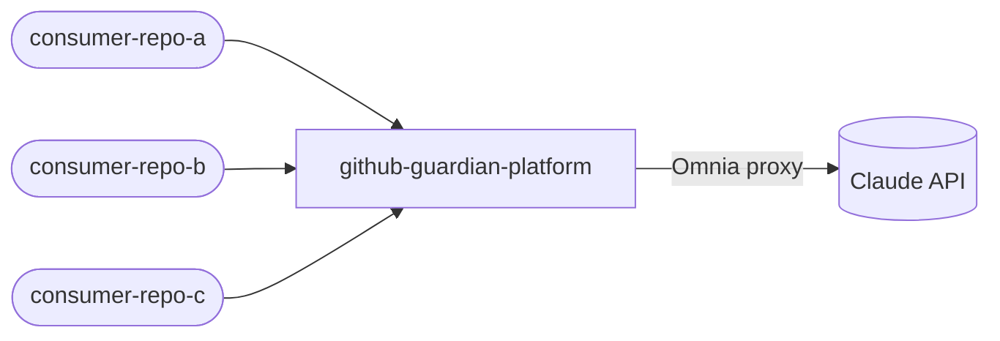
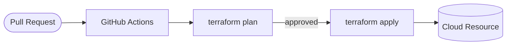
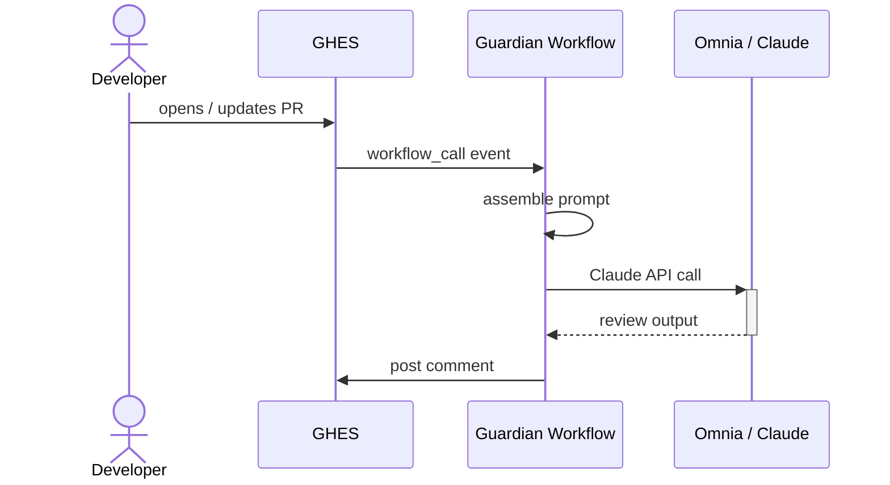

# Guardian Platform — Mermaid Templates

Ready-to-adapt templates for common Guardian and REA platform patterns.
All use `flowchart LR` and stay within the 7-node limit for PR descriptions.

---

## 1. Workflow Call Chain

Use when a PR changes how consumer repos trigger Guardian, or when Guardian's reusable workflow structure changes.



Adapt: replace the reusable workflow names with whichever ones the PR touches.

---

## 2. Prompt Assembly Pipeline

Use when a PR changes how Guardian assembles its prompts, adds/removes prompt layers, or modifies the profile system.



Adapt: omit layers not affected by the PR; use bold/emphasis in labels for changed layers.

---

## 3. Profile Resolution

Use when a PR changes profile YAML, profile selection logic, or the sed/awk parser.



---

## 4. Consumer Topology (multi-repo)

Use when onboarding documentation, architecture diagrams, or topology changes are the PR subject.



---

## 5. Generic PR Delivery Flow

Use for infrastructure, Terraform, or CI/CD PRs that show a resource being built and deployed.



---

## 6. Guardian Agent Response Flow

Use when a PR changes the guardian-agent workflow or how `@guardian` comments are handled.

```mermaid
flowchart LR
  Comment([@guardian mention]) --> Trigger[workflow_run event]
  Trigger --> AG[claude-guardian-agent.yml]
  AG --> Args[Build Claude args]
  Args --> CA[claude-code-action]
  CA -->|branch: guardian/*| GH[GitHub PR / comment]
```

---

## 7. Sequence Diagram — Multi-Step Interaction Flow

Use when the PR changes how components **call each other** over time: API chains, auth flows, multi-step processes, or GitHub Actions job sequences. Prefer this over a flowchart when ordering and responses matter.

Keep to **6 participants max** for readability in a PR comment at GitHub's fixed width.



**When to use sequence vs flowchart:**
- Flowchart → what components exist and how they connect (topology, delivery)
- Sequence → what happens in what order, including responses (interactions, call chains)

---

## Trimming to 7 Nodes

If your diagram exceeds 7 nodes, apply these cuts in order:

1. Collapse sequential steps with no branching into a single node (`-->|multi-step|`)
2. Remove nodes that are unchanged by the PR
3. Group related components into one labelled node (`[auth + session]`)
4. Split into two diagrams with a prose bridge between them
5. Use a C4 container diagram instead (see `references/c4-diagrams.md`)

---

## Label Conventions

Consistent labels make diagrams easier to scan across PRs:

| Pattern | Node label |
|---------|-----------|
| Consumer repo | `([consumer-repo])` (pill shape) |
| Reusable workflow file | `[workflow-name.yml]` |
| External API/service | `[(Service Name)]` (cylinder) |
| Entry point / trigger | `([Event Name])` (pill shape) |
| Decision / branch | `{condition?}` (diamond) |
| Cloud resource | `[(Resource Type)]` (cylinder) |
