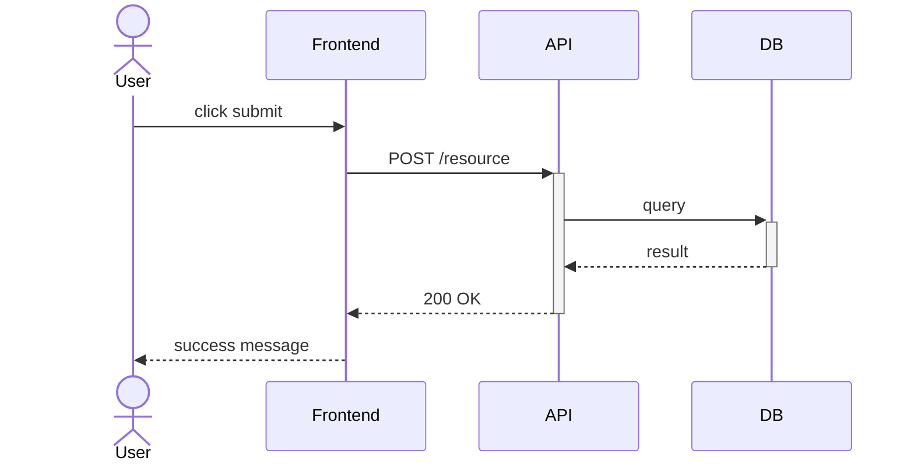
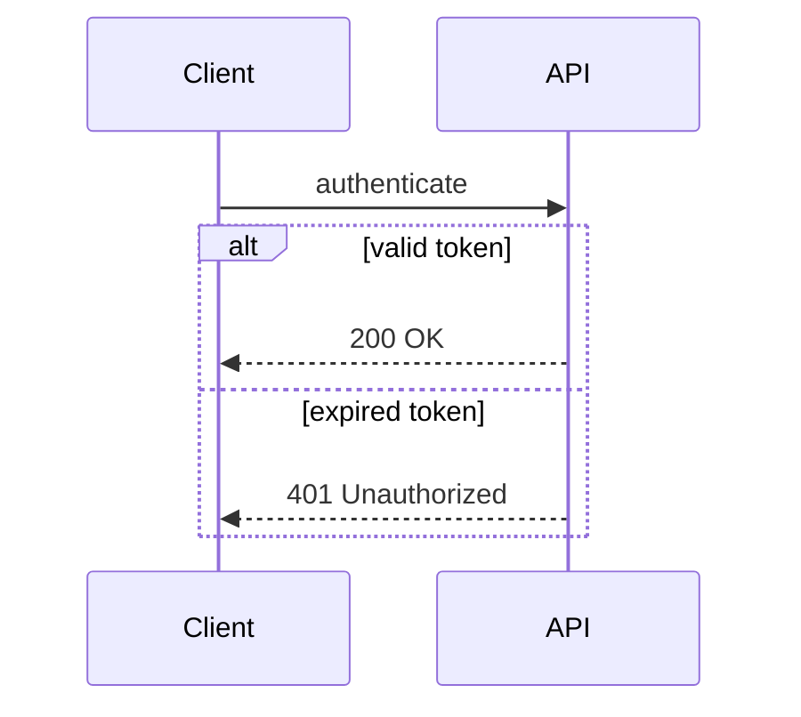
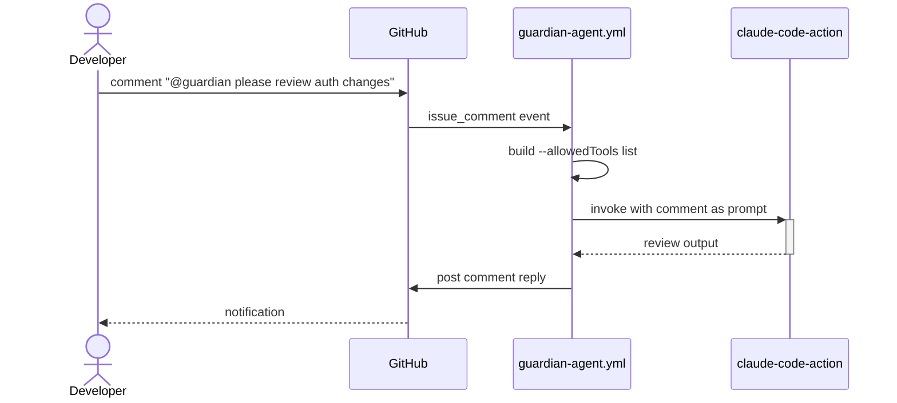

# Sequence Diagrams — GitHub/GHES Edition

`sequenceDiagram` is on the GHES-safe list. Use it in standalone platform documentation to show step-by-step interactions between system components — not in PR description diagrams (those should use `flowchart LR`).

---

## Core Syntax

**Participants:**
- `participant Name` — system component (service, workflow, API)
- `actor Name` — external entity (user, external system)
- `participant Short as "Long Label"` — alias for long names

**Arrow types:**
- `A->>B: message` — solid, synchronous call
- `A-->>B: message` — dashed, return/response
- `A-)B: message` — solid, async (fire-and-forget)
- `A-xB: message` — solid with X (delete/terminate)

**Activations** (show when a participant is actively processing):
- `A->>+B:` activates B
- `B-->>-A:` deactivates B

---

## Conditional Logic

- `alt / else / end` — conditional branches
- `opt / end` — optional block (executes 0 or 1 times)
- `loop label / end` — repeated block
- `par / and / end` — parallel execution

---

## Guardian Example: @guardian mention flow

---

## GitHub-Safe Notes

- **No clickable links** — `link Participant: Label @ URL` syntax is documented in Mermaid but does not work on GitHub; links and tooltips are stripped
- **No `autonumber` issues** — works fine, use it for complex flows where message ordering matters
- **Notes work:** `Note over A,B: text` and `Note right of A: text` both render correctly
- **Keep participants ≤ 6** — more than 6 becomes unreadable at GitHub's fixed PR comment width
- **`create participant` syntax** requires Mermaid 10.3+, available on GitHub.com but check GHES version
